# 📊 Suivi d’un Projet RH – Recrutement  
### 🗄️ Mini Projet SQL (2025–2026)
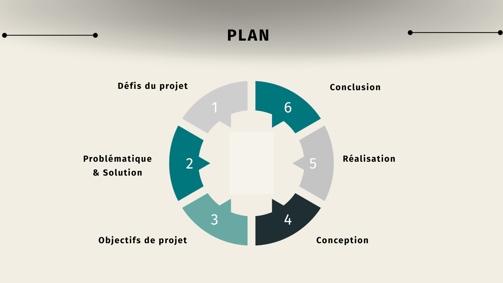
---

## 📌 Présentation du projet

Ce projet vise à mettre en place une **base de données relationnelle** permettant d’assurer un suivi efficace du processus de recrutement RH.

---

## 🚧 Défis du projet

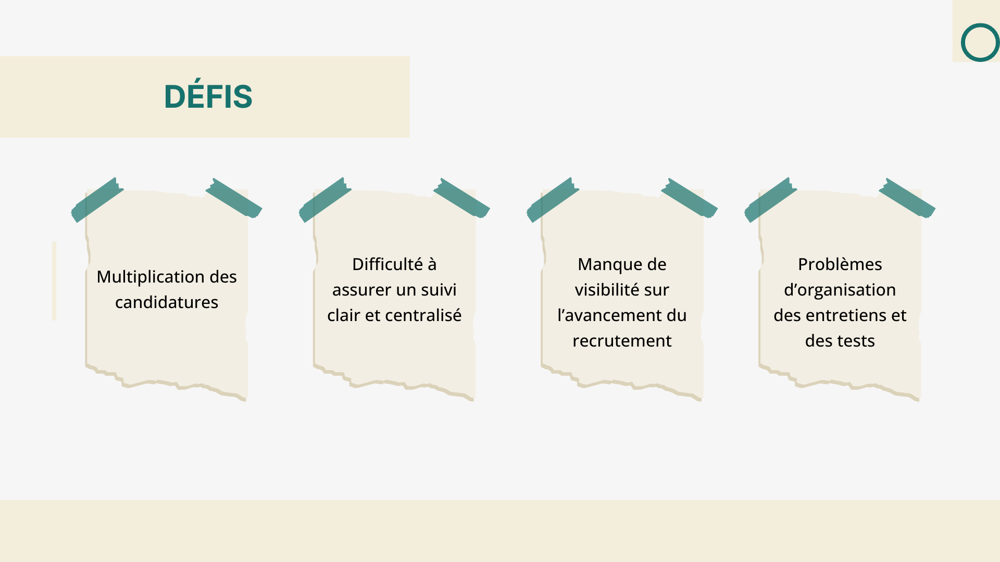

- Multiplication des candidatures  
- Mauvaise organisation des entretiens et tests  
- Manque de visibilité sur l’avancement  
- Difficulté de suivi centralisé  

---

## ❓ Problématique

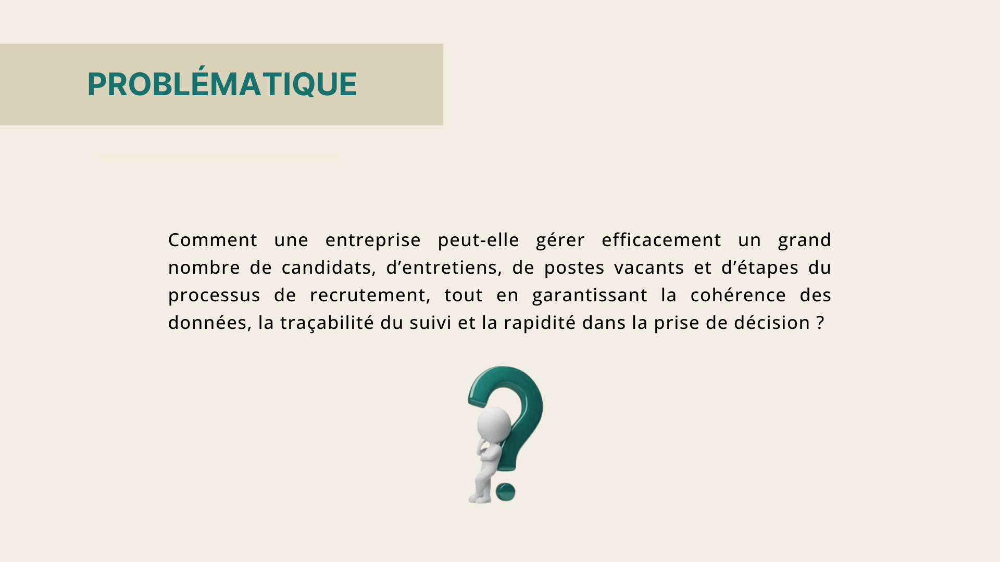

> Comment une entreprise peut-elle gérer efficacement les candidats, les postes, les entretiens et les étapes RH tout en garantissant la cohérence des données et une prise de décision rapide ?

---

## 💡 Solution proposée

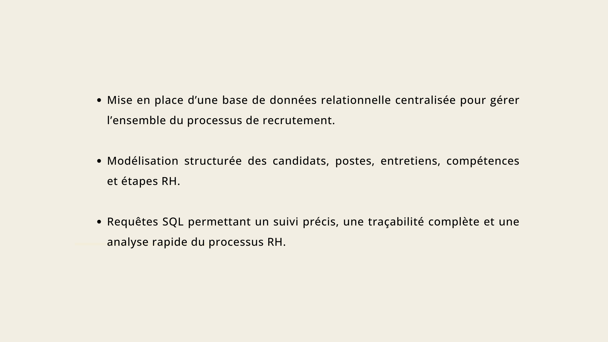

- Base de données relationnelle centralisée  
- Modélisation des candidats, postes, entretiens, compétences  
- Requêtes SQL pour le suivi et l’analyse RH  

---

## 🎯 Objectifs du projet

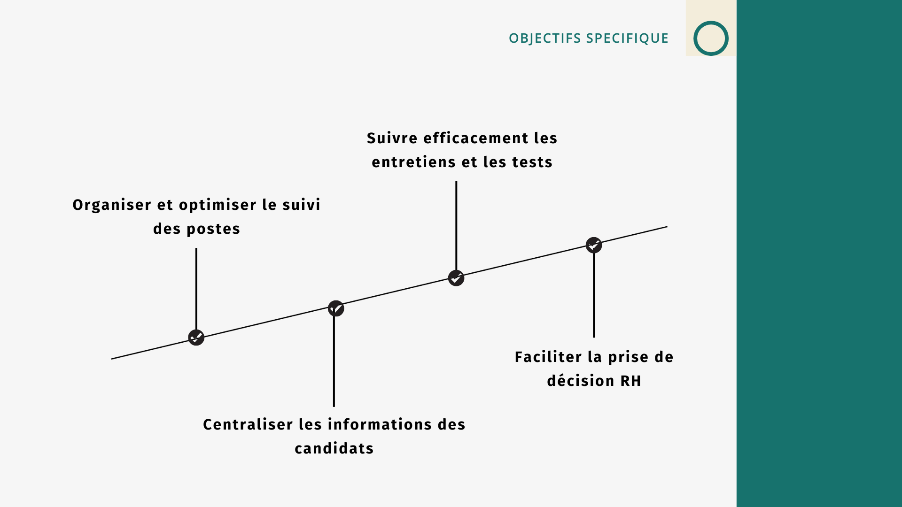

- Centraliser les informations des candidats  
- Optimiser le suivi des postes  
- Améliorer la gestion des entretiens et tests  
- Faciliter la prise de décision RH  

---

## 🧩 Modèle logique de données (MLD)

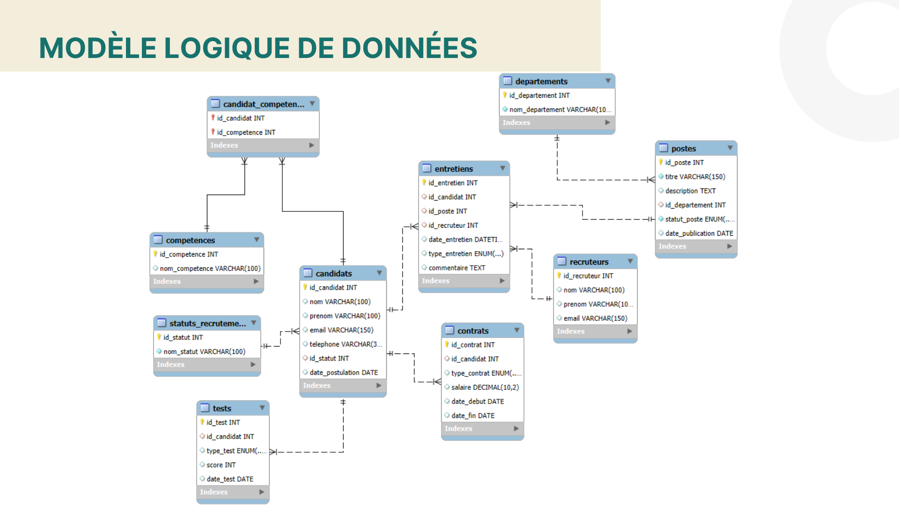

Le modèle relationnel permet une structuration claire et cohérente des données RH.

---

## 📄 Exemples de requêtes SQL

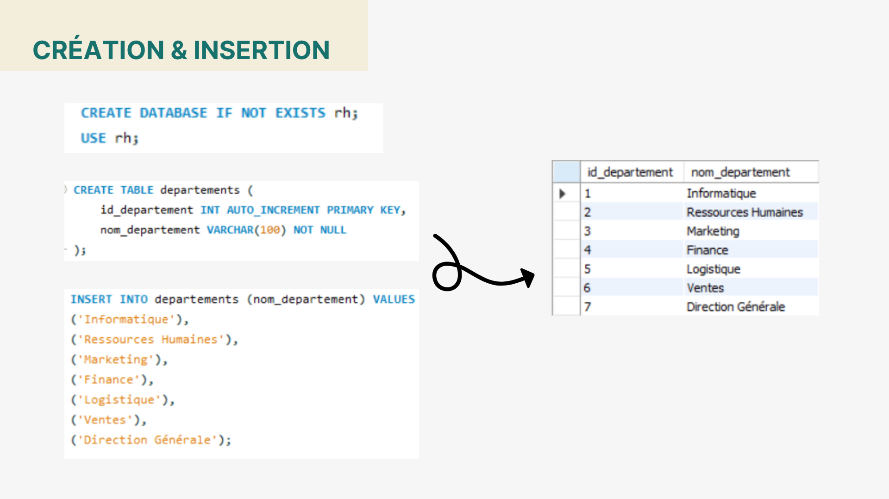
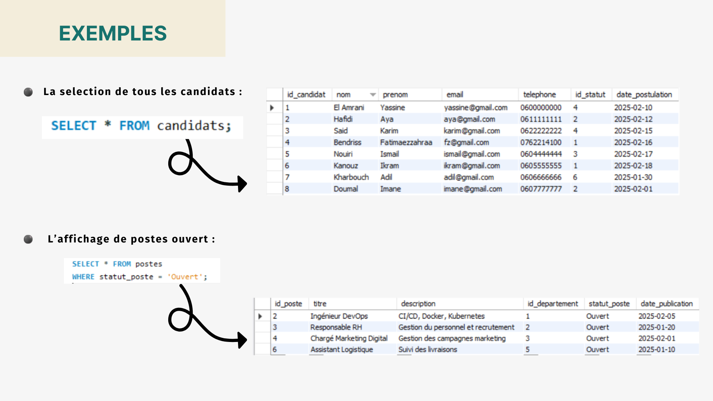
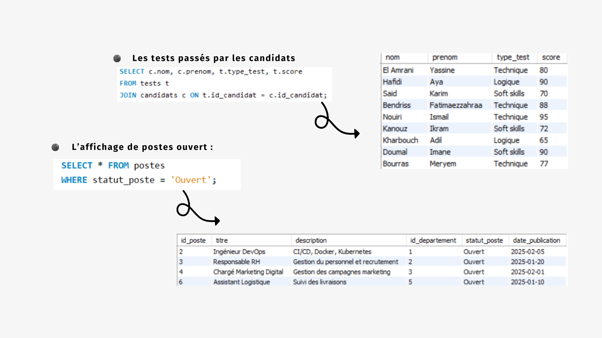
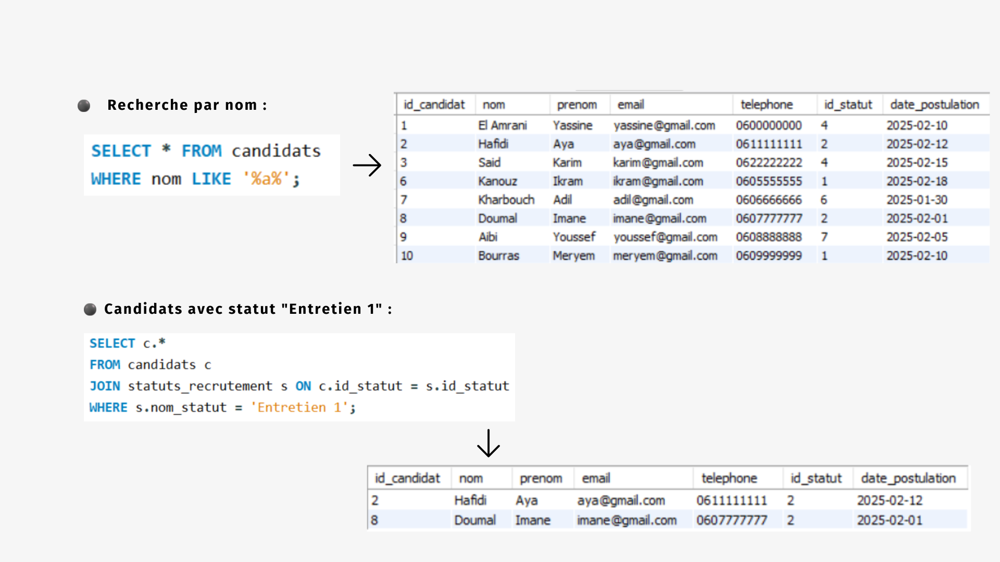
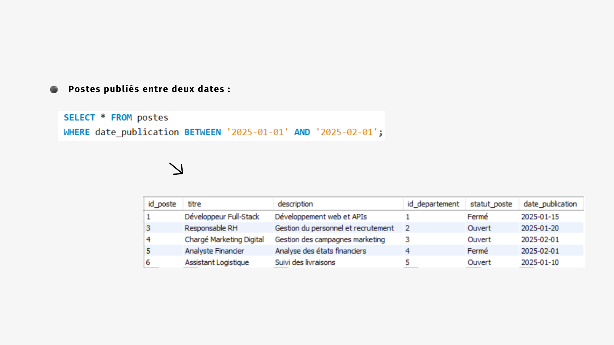
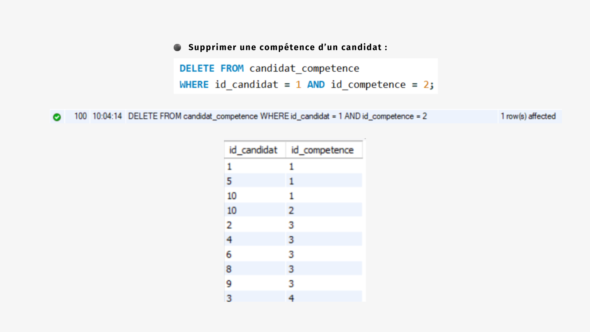
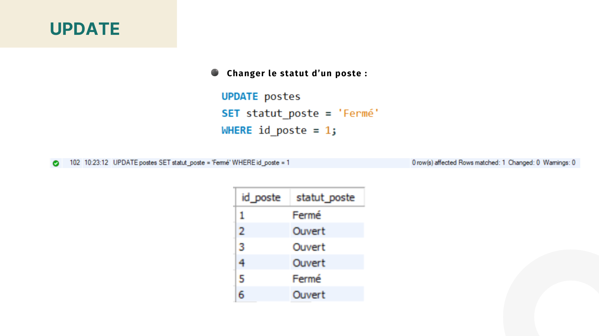
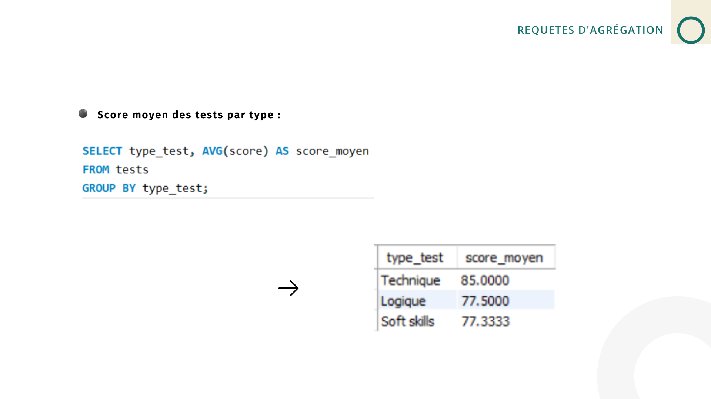
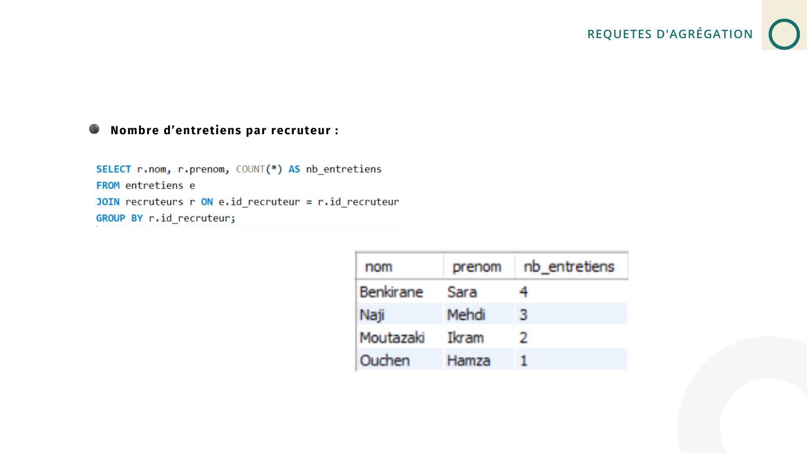

- Sélection des candidats  
- Postes ouverts  
- Recherche par nom  
- Candidats avec statut *Entretien 1*  
- Requêtes d’agrégation et mises à jour  

---

## 🏁 Conclusion

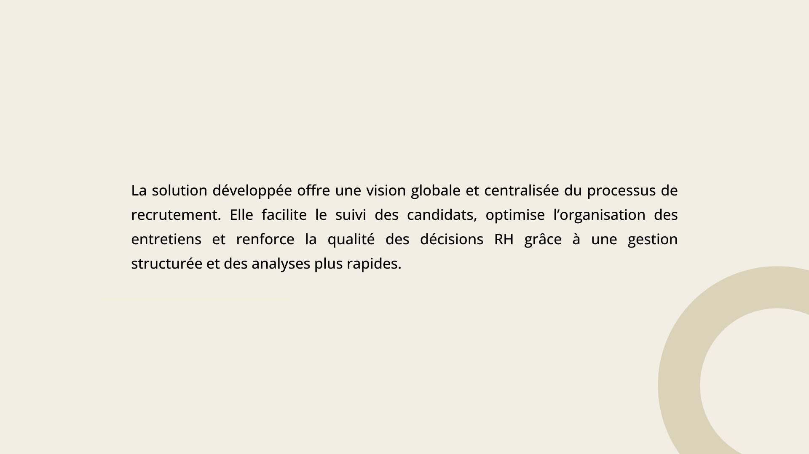

La solution développée offre une **vision globale et centralisée** du recrutement, améliorant l’organisation RH et la qualité des décisions.

---

